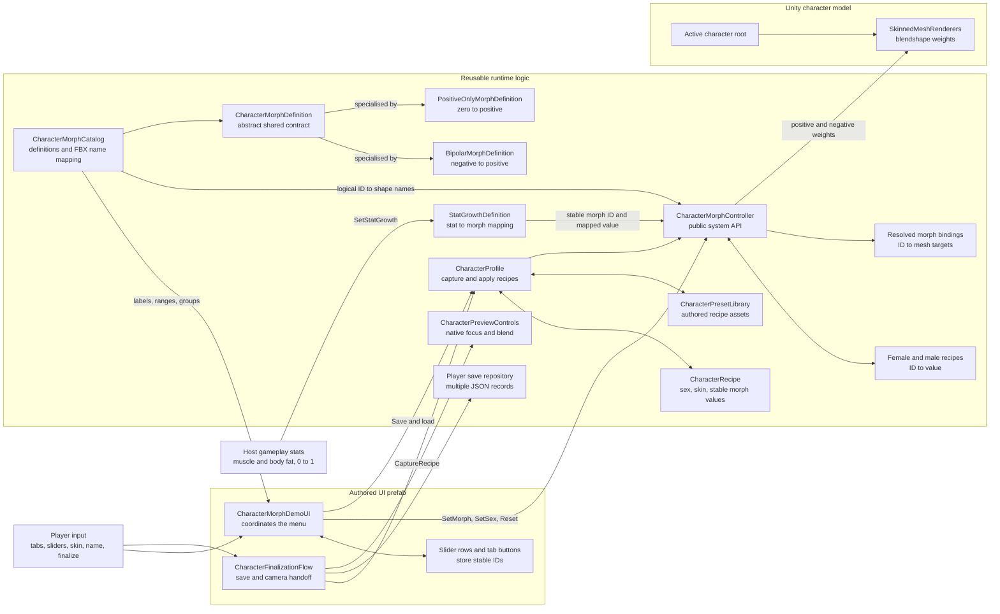

# Character Customization: Architecture and Pseudocode

This page describes the current implemented architecture for the system presentation.

## Architecture



The stable morph ID is the boundary between presentation and model-specific data. For example, the UI uses `body.weight`; only the catalogue needs to know the imported FBX blendshape names. This keeps the controller API readable and reduces direct dependencies on the current character asset.

`CharacterMorphDefinition` is an abstract base class. Its two concrete subclasses inherit the shared metadata and shape-name lookup, then override the valid range, required blendshapes, and weight calculation. The controller uses the base type and delegates those differences polymorphically.

`StatGrowthDefinition` is deliberately composed with the morph system rather than inheriting from a morph definition. Stat growth describes where a value comes from; bipolar or positive-only describes how that value affects blendshapes. Keeping those responsibilities separate lets muscle and body fat use the same stat API despite having different morph behaviour.

## Concise Pseudocode

### Initialise the system

```text
INITIALISE
    create a zeroed recipe for Female and Male

    for each character
        find every SkinnedMeshRenderer under its root
        for each catalogue definition
            resolve positive and negative blendshape indices
            store the matching renderer targets by stable morph ID

    bind each authored UI row to its catalogue definition
    create a fallback row only when an authored row is missing
    select Female and display the Body group
```

### Apply a slider change

```text
SET MORPH(morph ID, requested value)
    find the definition for morph ID
    if the ID is unknown, stop safely

    clamp value to the definition's allowed range
    save value in the active character's recipe

    ask the concrete morph definition to calculate its weights
        bipolar definition maps negative and positive values to separate shapes
        positive-only definition produces only a positive weight

    for each resolved renderer target
        apply positive weight to the positive blendshape
        apply negative weight to the negative blendshape when it exists
```

### Switch or reset a character

```text
SET CHARACTER(selected sex)
    show the selected character root and hide the other
    apply that character's saved recipe
    refresh the visible sliders

RESET CURRENT CHARACTER
    for each catalogue definition
        set its value to zero in the active recipe
        apply zero to its resolved blendshapes
    refresh the visible sliders
```

### Apply gameplay stat growth

```text
SET STAT GROWTH(stat ID, normalized value)
    find the stat-growth definition
    clamp the incoming host-game value between zero and one
    map it to the definition's morph output range
    send the mapped value and stable morph ID through SET MORPH

MUSCLE
    zero stat maps to zero muscle
    full stat maps to full muscle

BODY FAT
    zero stat maps to the slim weight shape
    half stat maps to neutral weight
    full stat maps to the heavy weight shape
```

### Save, load, or finalize a recipe

```text
SAVE PRESET
    read and trim the entered preset name
    create a new named library entry or select the matching existing entry
    capture sex, skin and every catalogue morph in catalogue order
    overwrite the CharacterPreset recipe
    persist the ScriptableObject asset immediately when running in the Unity Editor

LOAD PRESET
    select a named entry from the preset dropdown
    reject empty or duplicate identifiers
    warn and ignore identifiers that are not in the catalogue
    apply the recipe through CharacterProfile
    switch to the stored sex and skin
    for each catalogue definition
        apply its stored value, or zero when it is missing
    refresh the visible sliders

RESET TAB
    set only the selected morph group's values to zero

RESET ALL
    set every morph value on the visible character to zero

FINALIZE PLAYER
    require a trimmed character name
    capture the current CharacterRecipe
    if the case-insensitive name already exists, require a second confirmation
    atomically write the record list to players.json
    raise Finalized with the saved record
    when a gameplay camera is assigned, blend the preview transform and FOV before enabling gameplay
```

## Presentation Summary

- The UI knows stable IDs, labels and ranges, not mesh indices.
- The controller encapsulates recipes, character switching and blendshape application.
- Inheritance removes morph-type decisions from the controller: each definition owns its behaviour.
- Stat-growth definitions connect normalized gameplay values to muscle and body-fat morphs without owning progression rules.
- Male and female recipes are independent and remain in memory while switching.
- One versioned recipe shape is shared by authored presets, NPC profiles and durable player records.
- Player names and stable record IDs live outside reusable appearance recipes.
- The preview camera stays dependency-free and hands off to an optional gameplay camera natively.
- One catalogue contains model-specific naming differences in a predictable place.
- Missing or incomplete bindings fail safely and can be reported by the validator.

## How to Explain the Inheritance

> I used inheritance where the morph definitions share a stable contract but have genuinely different behaviour. The abstract definition stores common metadata and shape-name mapping. Bipolar and positive-only definitions override their range, required shapes and weight calculation. The controller only depends on the base type, so another morph behaviour can be added without rewriting the controller.
