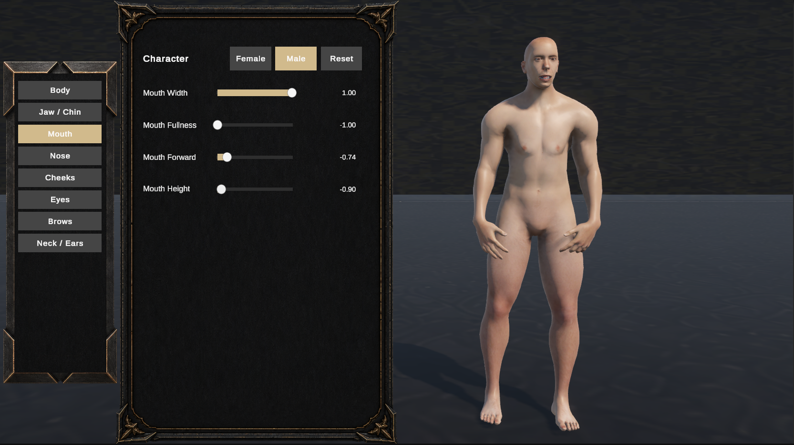
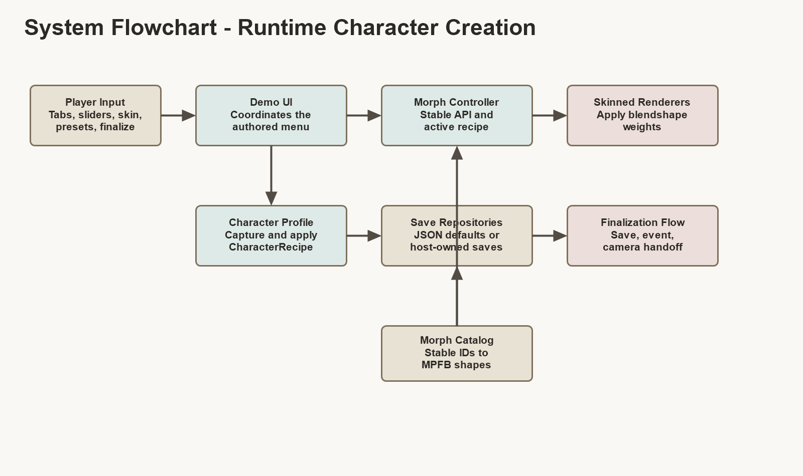

# Reusable Character Customization System

<p align="center">
  
</p>

<p align="center">
  <strong>A Unity 6 reusable character creation prototype for GAD176 Project 1.</strong><br>
  Stable morph IDs, authored UI, runtime presets, finalized player saves, and host-game extension hooks.
</p>

## Overview

This project builds a scalable character customization system for adventure-style Unity games. The goal is to let a host game create, edit, save, reload, and finalize a character without depending directly on imported FBX blendshape names.

The public system talks in stable IDs such as `body.weight` and `body.muscle`. Model-specific MPFB blendshape names stay inside `CharacterMorphCatalog`, so the UI, save data, and host-game API can remain readable and reusable.

<p align="center">
  
</p>

## Features

- Male and female MPFB character variants with independent recipes.
- Stable morph IDs across body and face controls.
- Bipolar morphs for negative/positive shape pairs.
- Positive-only morphs for one-way controls such as muscle.
- Skin swatches and custom skin colour support.
- Authored Unity UI prefab with tabbed morph groups.
- Runtime preset save/load through JSON.
- Named player finalization through JSON.
- Optional native camera handoff after finalization.
- Host-game hooks for custom save systems and gameplay integration.

## System Flow

<p align="center">
  
</p>

Runtime flow:

1. The player changes tabs, sliders, skin, presets, or finalization controls.
2. `CharacterMorphDemoUI` routes those requests to the profile, controller, or save repositories.
3. `CharacterMorphController` resolves stable IDs and applies blendshape weights to the active character.
4. `CharacterProfile` captures and reapplies reusable `CharacterRecipe` data.
5. Runtime presets and finalized players are saved through default JSON repositories, or through host-provided repositories.

## Project Requirements Covered

This project is built for the GAD176 Project 1 scalable-system brief:

- Standalone scalable system that can be reused outside one specific scene.
- Modular architecture with clear class responsibilities.
- Object-oriented design through encapsulation, inheritance, and polymorphism.
- Planned system logic documented with diagrams and pseudocode.
- Managed dependency boundary around MPFB/FBX naming.
- Version control evidence through commit history.
- Presentation-ready documentation and visual aids.
- Reflection points around trade-offs, limitations, and next steps.

## Unity Requirements

- Unity `6000.3.9f1`
- Universal Render Pipeline `17.3.0`
- Unity Input System `1.18.0`
- Unity UI / TextMeshPro
- Unity Test Framework `1.6.0`

The demo currently uses MPFB-generated character assets. MPFB-specific names are treated as imported implementation details, not as the public API.

## Important Scripts

| Script | Responsibility |
| --- | --- |
| `CharacterMorphController` | Active sex, morph values, stat growth, and blendshape application. |
| `CharacterMorphCatalog` | Stable morph IDs, labels, groups, ranges, and MPFB shape mappings. |
| `CharacterMorphDefinition` | Abstract base contract for morph behaviour. |
| `BipolarMorphDefinition` | Negative-to-positive morphs using paired blendshapes. |
| `PositiveOnlyMorphDefinition` | Zero-to-one morphs using one blendshape. |
| `CharacterProfile` | Captures and applies complete character recipes. |
| `CharacterMorphDemoUI` | Coordinates tabs, sliders, skin, presets, and authored menu controls. |
| `CharacterFinalizationFlow` | Saves named player records and optionally hands off to gameplay camera control. |
| `CharacterPresetSaveRepository` | Saves runtime presets to JSON. |
| `CharacterPlayerSaveRepository` | Saves finalized player records to JSON. |

## Runtime Saves

Default runtime data is stored under:

```text
Application.persistentDataPath/SolCharacterCustomization/
```

Default files:

- `presets.json` stores user-created appearance presets.
- `players.json` stores finalized named player records.

Host games can keep the default JSON save files, subscribe to events, or replace the repositories entirely.

```csharp
menu.SetPresetRepository(customPresetRepository);
menu.RuntimePresetSaved += preset => AppendToGameSave(preset.Recipe);
menu.PresetLoaded += (name, recipe) => TrackPresetUse(name);

finalization.SetPlayerSaveRepository(customPlayerRepository);
finalization.Finalized += player => AttachCharacterToPlayer(player.Recipe);
```

Gameplay stats can also drive morphs without owning the customization UI:

```csharp
controller.SetStatGrowth("muscle", normalizedStrength);
controller.SetStatGrowth("body_fat", normalizedBodyFat);
```

## Validation

Run the editor validator before presenting, packaging, or handing off the project:

```text
Tools > Character Customization > Validate Morph Demo
```

The validator checks authored menu wiring, morph catalogue coverage, skin palette setup, preset references, finalization references, scene wiring, and expected UI input links.

For code-level checks:

```powershell
dotnet build Assembly-CSharp.csproj -nologo
dotnet build Assembly-CSharp-Editor.csproj -nologo
```

## Documentation

- [`Documentation/CharacterCustomization.md`](Documentation/CharacterCustomization.md) records current design decisions, validation notes, and next steps.
- [`Documentation/SystemPresentationArchitecture.md`](Documentation/SystemPresentationArchitecture.md) contains the architecture notes and pseudocode used for the system presentation.

## Current Scope

Included in this iteration:

- Character morph sliders and tabbed categories.
- Stable recipe capture and application.
- Authored and runtime presets.
- Runtime JSON saving for presets and finalized players.
- Skin tone and custom colour support.
- Optional native camera handoff.
- Host-game API hooks for save integration.

Not included yet:

- Package metadata and assembly-definition split.
- Serialized morph profiles for non-MPFB character packs.
- Eye, hair, clothing, or equipment selectors.
- Full installation, licence, version, and changelog files for distribution.

## Status

The system is presentation-ready for the GAD176 Project 1 prototype brief, with remaining work focused on packaging, broader automated test coverage, and replacing the hardcoded MPFB catalogue with serialized profiles.
