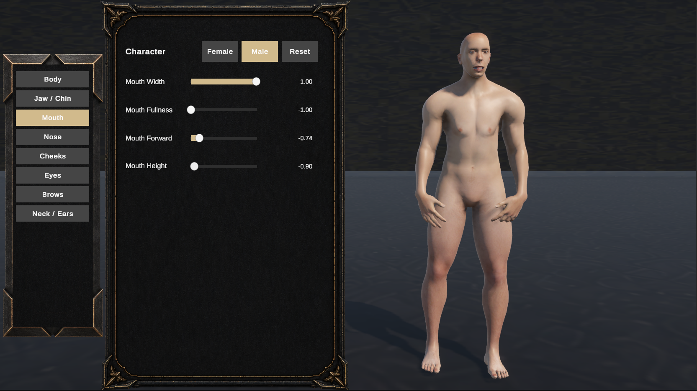
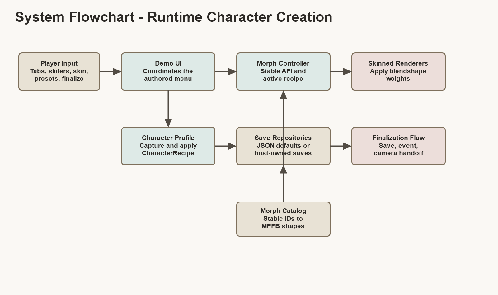

# Reusable Character Customization System

<p align="center">
  
</p>

<p align="center">
  <strong>A Unity 6 reusable character creation prototype for GAD176 Project 1.</strong><br>
  Stable morph IDs, authored UI, runtime presets, finalized player saves, and host-game extension hooks.
</p>

## Overview

This project builds a scalable character customization system for adventure-style Unity games. The goal is to let a host game create, edit, save, reload, and finalize a character without depending directly on imported FBX blendshape names.

The public system talks in stable IDs such as `body.weight`, `body.muscle`, and `body.height`. Model-specific MPFB blendshape names stay inside the morph catalog, so the UI, save data, and host-game API can remain readable and reusable. Surface morphs are handled by blendshapes; skeletal proportion morphs are routed through the rig driver.

<p align="center">
  
</p>

## Features

- Male and female MPFB character variants with independent recipes.
- Stable morph IDs across body and face controls.
- Authored `CharacterMorphCatalogAsset` with static fallback definitions.
- Bipolar morphs for negative/positive shape pairs.
- Positive-only morphs for one-way controls such as muscle.
- Separated blendshape and skeletal-proportion driver paths.
- Body tab consolidation for BodyMorphLite-style local-bone proportion sliders.
- Optional foot grounding and Animator IK bridge for proportion-aware animation.
- Skin swatches and custom skin colour support.
- Authored Unity UI prefab with tabbed morph groups.
- Runtime preset save/load through JSON.
- Named player finalization through JSON.
- Optional native camera handoff after finalization.
- Host-game hooks for custom save systems and gameplay integration.

## System Flow

<p align="center">
  
</p>

Runtime flow:

1. The player changes tabs, sliders, skin, presets, or finalization controls.
2. `CharacterMorphDemoUI` routes those requests to the profile, controller, or save repositories.
3. `CharacterMorphController` resolves stable IDs through the assigned catalog asset or static fallback.
4. Blendshape definitions apply mesh weights; skeletal definitions apply bind-pose-safe bone scale or offset through `CharacterRigProportionDriver`.
5. `CharacterProfile` captures and reapplies reusable `CharacterRecipe` data.
6. Runtime presets and finalized players are saved through default JSON repositories, or through host-provided repositories.

## Project Requirements Covered

This project is built for the GAD176 Project 1 scalable-system brief:

- Standalone scalable system that can be reused outside one specific scene.
- Modular architecture with clear class responsibilities.
- Object-oriented design through encapsulation, inheritance, and polymorphism.
- Planned system logic documented with diagrams and pseudocode.
- Managed dependency boundary around MPFB/FBX naming.
- Version control evidence through commit history.
- Presentation-ready documentation and visual aids.
- Reflection points around trade-offs, limitations, and next steps.

## Unity Requirements

- Unity `6000.3.9f1`
- Universal Render Pipeline `17.3.0`
- Unity Input System `1.18.0`
- Unity UI / TextMeshPro
- Unity Test Framework `1.6.0`

The demo currently uses MPFB-generated character assets. MPFB-specific names are treated as imported implementation details, not as the public API.

## Important Scripts

| Script | Responsibility |
| --- | --- |
| `CharacterMorphController` | Active sex, morph values, stat growth, and blendshape application. |
| `CharacterMorphCatalog` | Static fallback definitions for stable IDs, labels, groups, ranges, and MPFB shape mappings. |
| `CharacterMorphCatalogAsset` | Authored catalog asset used by prefabs when present. |
| `CharacterMorphDefinition` | Abstract base contract for morph behaviour. |
| `BipolarMorphDefinition` | Negative-to-positive morphs using paired blendshapes. |
| `PositiveOnlyMorphDefinition` | Zero-to-one morphs using one blendshape. |
| `CharacterRigProportionDriver` | Bind-pose-safe skeletal proportion driver and optional BML-style foot grounding. |
| `CharacterRigProportionProfile` | Authored min/max scale ranges for BML-style rig channels. |
| `CharacterRigAnimatorIkBridge` | `OnAnimatorIK` bridge on the active character Animator object. |
| `CharacterProfile` | Captures and applies complete character recipes. |
| `CharacterMorphDemoUI` | Coordinates tabs, sliders, skin, presets, and authored menu controls. |
| `CharacterFinalizationFlow` | Saves named player records and optionally hands off to gameplay camera control. |
| `CharacterPresetSaveRepository` | Saves runtime presets to JSON. |
| `CharacterPlayerSaveRepository` | Saves finalized player records to JSON. |
| `CharacterSkinColorSaveRepository` | Saves custom skin colours to JSON. |
| `CharacterEyeMaterialPalette` | Defines authored eye material choices used by recipes and UI swatches. |

## Runtime Saves

Default runtime data is stored under:

```text
Application.persistentDataPath/SolCharacterCustomization/
```

Default files:

- `presets.json` stores user-created appearance presets.
- `players.json` stores finalized named player records.
- `skin-colors.json` stores saved custom skin colours.

Recipes store sex, morph values, skin tone or custom skin colour, and eye material ID. Host games can keep the default JSON save files, subscribe to events, or replace the repositories entirely.

```csharp
menu.SetPresetRepository(customPresetRepository);
menu.SetCustomSkinRepository(customSkinRepository);
menu.RuntimePresetSaved += preset => AppendToGameSave(preset.Recipe);
menu.PresetLoaded += (name, recipe) => TrackPresetUse(name);
menu.RuntimePresetDeleted += presetName => RemoveFromGameSave(presetName);

finalization.SetPlayerSaveRepository(customPlayerRepository);
finalization.Finalized += player => AttachCharacterToPlayer(player.Recipe);
```

Gameplay stats can also drive morphs without owning the customization UI:

```csharp
controller.SetStatGrowth("muscle", normalizedStrength);
controller.SetStatGrowth("body_fat", normalizedBodyFat);
```

## Validation

Run the editor validators before presenting, packaging, or handing off the project:

```text
Tools > Character Customization > Validate Morph Demo
Tools > Sol > Character Customization > Validate Selected Character Setup
```

The demo validator checks authored menu wiring, morph catalog coverage, skin palette setup, preset references, finalization references, scene wiring, and expected UI input links. The setup validator checks active roots, humanoid Animators, catalog validity, required bones, blendshape bindings, IK bridge presence, and Animator Controller IK Pass when grounding is enabled.

For code-level checks:

```powershell
dotnet build Assembly-CSharp.csproj -nologo
dotnet build Assembly-CSharp-Editor.csproj -nologo
```

## Documentation

- [`Documentation/CharacterCustomization.md`](Documentation/CharacterCustomization.md) records current design decisions, validation notes, and next steps.
- [`Documentation/API.md`](Documentation/API.md) is the methods and API guide for host-game integration.
- [`Documentation/SystemPresentationArchitecture.md`](Documentation/SystemPresentationArchitecture.md) contains the architecture notes and pseudocode used for the system presentation.
- [`Documentation/ThirdPartyNotices.md`](Documentation/ThirdPartyNotices.md) records BodyMorphLite attribution and MIT notice requirements for adapted rig/IK behavior.
- [`LICENSE.md`](LICENSE.md) states the project licence.

## Current Scope

Included in this iteration:

- Character morph sliders and tabbed categories.
- Catalog asset foundation with static fallback definitions.
- Skeletal proportion backend for height, shoulders, hips, and BML-style rig sliders.
- Inspector BML test controls remain available for direct driver testing.
- Stable recipe capture and application.
- Authored and runtime presets.
- Runtime JSON saving for presets and finalized players.
- Skin tone and custom colour support.
- Eye material swatches with recipe persistence.
- Optional native camera handoff.
- Host-game API hooks for save integration.

Not included yet:

- Package metadata and assembly-definition split.
- Clean package extraction into runtime, UGUI, editor, tests, and samples boundaries.
- Verified plug-and-play setup on a brand-new humanoid character.
- Full Play Mode IK parity tests for flat ground, steps, sex switching, and finalize handoff.
- Hair, clothing, or equipment selectors.
- Full installation, version, changelog, and package metadata files for distribution.

## Status

The system is presentation-ready for the GAD176 Project 1 prototype brief and now has the core BodyMorphLite-style rig backend merged in a CharacterEditor-safe way. Remaining work is focused on Unity Play Mode validation, package boundary cleanup, demo asset separation, licensing audit, and broader automated test coverage.
